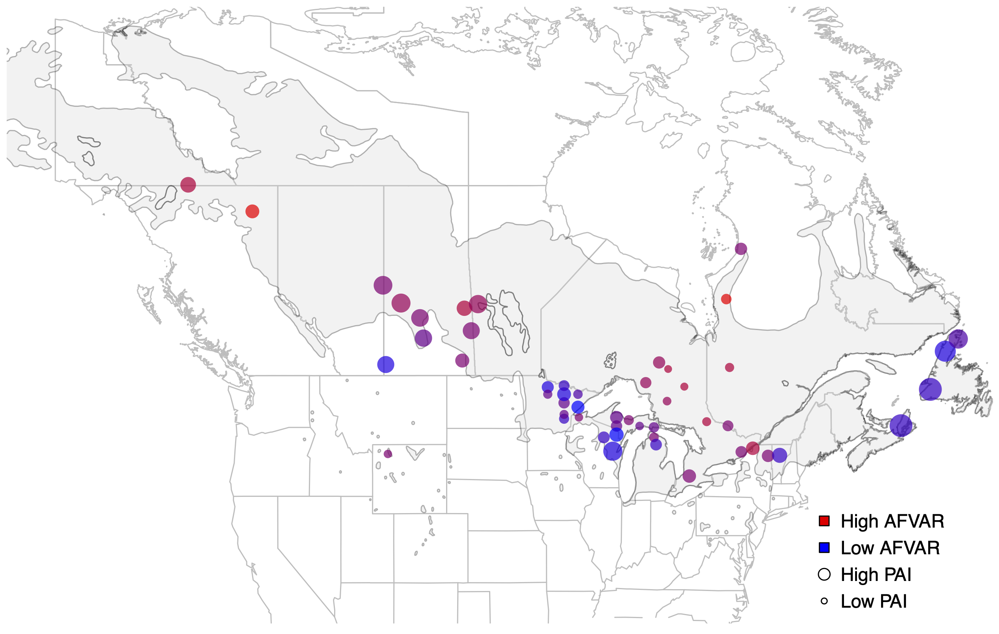

### [Return to Main Menu](../index.html)

## Table of Contents

- [1. Goals](#goals)

- [2. Data for the exercise](#data-for-the-exercise)

- [3. File Management](#file-management)


- [4. Plotting](#plotting)


<br><br><br><br>
<br><br><br><br>
<br><br><br><br>
<br><br><br><br>
<br><br><br><br>
<br><br><br><br>
<br><br><br><br>
<br><br><br><br>
<br><br><br><br>
<br><br><br><br>
<br><br><br><br>
<br><br><br><br>
<br><br><br><br>
<br><br><br><br>
<br><br><br><br>
<br><br><br><br>
<br><br><br><br>
<br><br><br><br>
<br><br><br><br>
<br><br><br><br>
<br><br><br><br>
<br><br><br><br>
<br><br><br><br>
<br><br><br><br>
<br><br><br><br>
<br><br><br><br>
<br><br><br><br>
<br><br><br><br>
<br><br><br><br>
<br><br><br><br>
<br><br><br><br>


## 1. Goals


1. Draw a map of United States and Canada

2. Draw a layer showing distribution of a hypothetical species on this map

3. Overlay two population genetic metrics using a single set of points (one per pop) on the map


<br><br>


## 2. Data for the Exercise

All the data is contained within the ``data`` folder located at ``/Users/spatialr/data/`` on your iMac workstation. Navigate in R-Studio to that folder and then change to ``specieslayer`` directory. In there you will find following files:

```bash
drwxr-xr-x@ 5 vikram   160B Oct 10 07:54 popubals
drwxr-xr-x@ 6 vikram   192B Oct 10 07:55 canada
-rw-r--r--@ 1 vikram   819B Dec  6 21:18 814.pq
-rw-r--r--@ 1 vikram   3.7K Dec  6 21:18 popinfo.txt
-rw-r--r--@ 1 vikram   4.6K Dec  6 21:23 paisum814.df
```

Let's look at each file quickly after importing it into R:

<br>

### 2.1 ``popinfo.txt`` File

This file contains all the identifying information on the study populations. Ignore the distances as they are irrelevant to today's exercise. Each population has a three letter alphabetical code.


```r
library(tidyverse)

popinfo <- read_tsv("popinfo.txt")

popinfo

# A tibble: 51 × 9
   pop   mahalDist southernEdgeDist Zone  Location                 State_Province NumInds Longitude Latitude
   <chr>     <dbl>            <dbl> <chr> <chr>                    <chr>            <dbl>     <dbl>    <dbl>
 1 CBI       44.4          1510509. Core  Cape_Breton_Island       NS                   8     -61.2     46.1
 2 CHL       12.6           619981. Edge  Chaffey's_Lock           ON                   7     -76.2     44.6
 3 CLK       12.9          1548461. Core  Cold_Lake                AB                  14    -110.      54.2
 4 CPL        8.35          695595. Core  Chapleau                 ON                  14     -83.3     47.5
 5 CYH       15.6          1121559. Edge  Cypress_Hills_Prov._Park SK                  11    -110.      49.6
 6 DCK       11.1          1027383. Core  Duck_Mountain            SK                  13    -102.      51.6
 7 DPR        8.48          725548. Core  Deep_River               ON                  14     -77.5     46.1
 8 FIS       31.6          1801245. Core  Fischells_River          NL                   9     -58.4     48.2
 9 FNO        8.70         2413069. Core  Fort_Nelson              BC                  15    -122.      58.5
10 GAM       16.8          1058415. Core  Matagami                 QC                  15     -77.4     49.5
# … with 41 more rows
# ℹ Use `print(n = ...)` to see more rows

```

<br>


### 2.2 Population Genetic Metric: Allele Frequency Variance


```r

pq814 <- read_tsv("814.pq")

pq814

# A tibble: 51 × 2
   pop   pq_814
   <chr>  <dbl>
 1 CBI   0.0652
 2 CHL   0.0809
 3 CLK   0.0791
 4 CPL   0.0854
 5 CYH   0.0648
 6 DCK   0.0795
 7 DPR   0.0787
 8 FIS   0.0673
 9 FNO   0.100 
10 GAM   0.0901

```


<br>

### 2.3 Population Genetic Metric: Population Adaptive Index (PAI)


```r

paisum814 <- read_tsv("paisum814.df")

paisum814

# A tibble: 51 × 2
   pop   pai_sum
   <chr>   <dbl>
 1 CBI     21.9 
 2 CHL     11.2 
 3 CLK     17.9 
 4 CPL      8.28
 5 CYH     16.3 
 6 DCK     16.3 
 7 DPR     10.4 
 8 FIS     21.9 
 9 FNO     13.3 
10 GAM      8.79
# … with 41 more rows
# ℹ Use `print(n = ...)` to see more rows
```

<br><br>


## 3. File Management

There is a common element between all three files: the population names. We need to make sure that the populations appear in the exact same order in each file.  Let's do ordering within R.

```r
pq814a <- pq814[order(pq814$pop),]

paisum814a <- paisum814[order(paisum814$pop),]

popinfo2 <- popinfo[order(popinfo$pop),]

```

How do we make sure that the population order is now identical between all three files? Run the following commands, the output of which must be ``TRUE``, otherwise something went wrong:

```r
all.equal(pq814a$pop, popinfo2$pop) 

[1] TRUE


all.equal(pq814a$pop, paisum814a$pop)

[1] TRUE
```

Now we are ready for plotting. 

<br><br>


## 4. Plotting


First, load the necessary packages:


```r
library(maps)
library(mapdata)
library(maptools)
library(scales)
library(rgdal)
```

Then load the shapefiles for Canada and for the species distribution range.


```r
canada <- readOGR(dsn="canada/", layer="PROVINCE")

balsam <- readOGR(dsn="popubals/", layer="popubals")
```

Now we can begin making the map. Sometimes, printing the shapefiles can take a long time. To avoid a lag, we will use PDF device to output data step by step:


```r

pdf("balsam_pqpai_814.pdf", width=10, height=10)

maps::map('state', xlim=c(-145,-50), ylim=c(35,70), col='gray')

dev.off()
```

<br>
<center>

</center>
<br>

Check the map. It should show only United States. Next, we will add canada. Make sure to embed this line into the main script. For simplicity, we are only showing new code.


```r
plot(canada, add=T, border='gray')
```

<br>
<center>

</center>
<br>


Next, add a layer of species distribution range. We will use gray background color to depict this.


```r
plot(balsam, col=alpha('lightgray', 0.3), add=T, border=alpha('black', 0.3)) 
```

<br>
<center>

</center>
<br>


Now comes the fun part. We will plot the population genetic metrics. But first, create a color palette as follows:


```r
mypalette <- colorRampPalette(c('blue', 'red'))
```

Plot points using the latitude and longitude values for each population. Then link size of the points to one of the population genetic metric (allele frequency variance) and their color gradient (blue to red) to the second population genetic metric (population adaptive index):


```r
points(popinfo$Longitude, popinfo$Latitude, col=alpha(mypalette(10), 0.7)[as.numeric(cut(pq814$pq_814, breaks=10))], pch=16, cex=paisum814a$pai_sum/8)
```

<br>
<center>

</center>
<br>


Finally, we need a legend so that we can identify what the color and size parameters mean:


```r
pdf("balsam_pqpai_814.pdf", width=10, height=10)

maps::map('state', xlim=c(-145,-50), ylim=c(35,70), col='gray')

plot(canada, add=T, border='gray')

plot(balsam, col=alpha('lightgray', 0.3), add=T, border=alpha('black', 0.3)) 

points(popinfo$Longitude, popinfo$Latitude, col=alpha(mypalette(10), 0.7)[as.numeric(cut(pq814$pq_814, breaks=10))], pch=16, cex=paisum814a$pai_sum/8)

legend(-70, 42, c("High AFVAR", "Low AFVAR", "High PAI", "Low PAI"), pch=c(22,22,21,21), bty='n', y.intersp=1.2,
	pt.bg=c("red", "blue", "white", "white"), col=c("black", "black", "black", "black"), pt.cex=c(1.3,1.3,1.4,0.7), cex=1)

dev.off()
```

<br>
<center>

</center>
<br>


